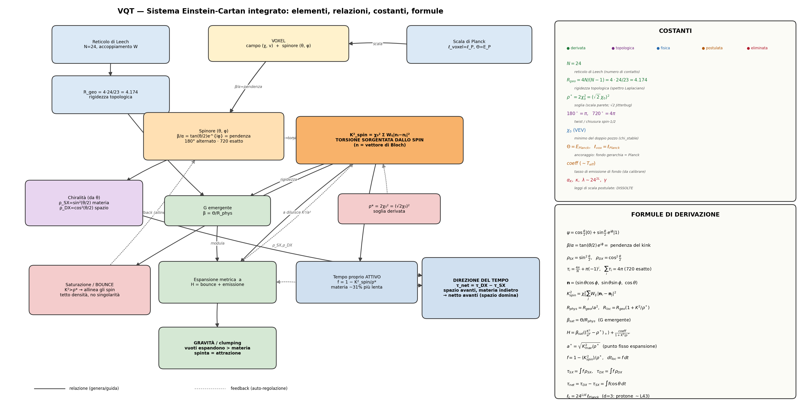

# VQT — Voxel Quantum Theory

## Gravità emergente da un reticolo frattale — Einstein-Cartan: la torsione dallo spin


---

## Panoramica

**VQT** simula lo spaziotempo come un **manifold frattale gerarchico** ($N = 24^L$ voxel;
il 24 dal reticolo di Leech). La linea di ricerca corrente è il **motore Einstein-Cartan
completamente integrato**: ogni voxel è un campo scalare $\chi$ **più uno SPINORE**
($\beta/\alpha = $ pendenza del kink, twist $180°$ alternato che chiude a $720°$), e la
**torsione è sorgentata dallo SPIN**. Da quell'unica torsione $K^2_{\text{spin}}$ emergono,
come facce di un solo meccanismo:

- 🌍 **Gravità** (clumping): i vuoti espandono più della materia → la materia si addensa;
- 🌌 **Espansione metrica** (auto-regolante);
- ⏳ **Dilatazione gravitazionale del tempo** (la materia rallenta la fisica locale);
- ↔️ **Direzione del tempo**, emergente dall'integrazione materia/spazio.

Tutto è **additivo**: ogni meccanismo è dietro un flag opt-in (default OFF), il motore
legacy resta **bit-identico** (verificato dai GATE).

> La fase precedente **v3.0 "doppia elica"** (Ramo A Cosmology/RG-flow + Ramo B Peano-VQT)
> è il **substrato/fase precedente** — ancora valida ma non la linea corrente. È
> documentata in [docs/peano/VQT_MANIFESTO_TEORICO.md](docs/peano/VQT_MANIFESTO_TEORICO.md)
> e [docs/cosmology/](docs/cosmology/).

### Schema d'insieme



*Voxel (campo + spinore) → **torsione dallo spin** $K^2_{\text{spin}}$ (cuore) → le quattro
facce tipo-Relatività-Generale. A destra: tutte le costanti (con stato) e le formule di
derivazione. Generato da `tools/rendering/genera_diagramma_vqt.py`.*

---

## La fisica in breve

- **Voxel** = campo $(\chi, v)$ + **spinore** $\psi = \cos\frac{\theta}{2}|0\rangle +
  \sin\frac{\theta}{2}e^{i\phi}|1\rangle$, con $\beta/\alpha = \tan(\theta/2)e^{i\phi} =$
  **pendenza del kink** ($\theta$ dalla pendenza locale del campo).
- **Chiralità** (da $\theta$): $\rho_{SX} = \sin^2(\theta/2)$ = **materia**,
  $\rho_{DX} = \cos^2(\theta/2)$ = **spazio**.
- **Torsione dallo spin**: $K^2_{\text{spin}} = \chi_0^2 \sum_j W_{ij}|\mathbf{n}_i -
  \mathbf{n}_j|^2$ ($\mathbf{n}$ = vettore di Bloch). **Lo spin genera la torsione.**
- **Saturazione/bounce** (sullo spin, soglia $\rho^* = 2\chi_0^2 = (\sqrt2\chi_0)^2$),
  **espansione** $H = $ bounce + emissione, **gravità** (clumping), **tempo proprio
  attivo** $f = 1 - K^2_{\text{spin}}/\rho^*$ e **direzione del tempo**
  $\tau_{\text{net}} = \tau_{DX} - \tau_{SX}$.
- **G emergente**: $\beta = \Theta/R_{geo}$, con $R_{geo} = 4N/(N-1) = 4\cdot24/23 = 4.174$
  **topologica** (Sakharov/Verlinde).
- **Scala metrica**: $\ell_{\text{voxel}} = \ell_{\text{Planck}}$ (ancoraggio).

Teoria formale completa, costanti e formule: **[docs/peano/VQT_FORMALIZZAZIONE.md](docs/peano/VQT_FORMALIZZAZIONE.md)**.

---

## Struttura del progetto

```text
VQT_repo/
├── wqt_oop/                          # MOTORE
│   ├── segmento_quantistico.py       #   voxel L0: campo (χ,v) + spinore (θ,φ) + tempo proprio
│   ├── solitone_composito.py         #   nodo frattale (24 figli); evolve* additivi
│   ├── einstein_cartan.py            #   saturazione (bounce) + chiusura 720
│   ├── muratore_planck.py            #   espansione metrica auto-regolante
│   ├── rigidezza_geometrica.py       #   G emergente (R_geo = 4·24/23)
│   ├── scala_planck.py               #   scala metrica (voxel = ℓ_Planck)
│   ├── motore_chirale_spinoriale.py  #   spinore (β/α=pendenza, 180/720), torsione dallo spin
│   ├── physics_context.py · energy_metrics.py · ...   (substrato condiviso)
│   └── reference/                    #   moduli di riferimento per task pendenti
│
├── experiments/exp3/                 # esperimenti EC (gravità, cosmogenesi, direzione tempo, ...)
├── tools/rendering/genera_diagramma_vqt.py   # genera lo schema d'insieme
├── docs/peano/                       # VQT_FORMALIZZAZIONE · EDIFICIO_EINSTEIN_CARTAN · CHECKPOINT · INDEX
├── docs/figures/vqt_sistema.png      # schema del sistema
└── docs/{cosmology,history,obsoletes,reports,reference}/   # substrato + archivio
```

👉 Hub documentazione: **[docs/peano/INDEX.md](docs/peano/INDEX.md)**

---

## Quick Start

```bash
pip install -r requirements.txt          # numpy, scipy, h5py, matplotlib

# GATE (additività + fisica EC) — devono passare
python -m wqt_oop.test_einstein_cartan_equivalence
python -m wqt_oop.test_muratore_equivalence

# Gravità sul motore COMPLETO (clumping da torsione dallo spin)
python experiments/exp3/test_gravita_clumping.py

# Direzione del tempo (materia indietro / spazio avanti, netto avanti)
python experiments/exp3/test_inversione_tempo.py

# Rigenera lo schema d'insieme (diagramma + costanti + formule)
python tools/rendering/genera_diagramma_vqt.py
```

**Usare il motore completo nel codice** (d'ora in poi lo standard per i test):

```python
root.set_ec_integrato(coeff)   # spinore + torsione dallo spin + espansione/gravità
for _ in range(N):
    root.compute_hamiltonian(); root.evolve_with_muratore(dt)
```

---

## Risultati

**Verificati [D]** (GATE/self-test PASS; legacy bit-identico con flag OFF):

- Einstein-Cartan integrato: **una sola torsione** ($K^2_{\text{spin}}$, dallo spin) guida
  saturazione, espansione, gravità, dilatazione e direzione del tempo.
- **G topologica e scala-invariante**: $R_{geo} = 4\cdot24/23 = 4.174$ (dal 24, **non**
  $24^L$); **G non-monotona** con la scala (ingrediente per la tensione di Hubble).
- **Gravità (clumping)**: i vuoti espandono più della materia.
- **Tempo proprio attivo**: la materia ~31% più lenta; **direzione del tempo emergente**
  (materia indietro / spazio avanti → netto avanti perché lo spazio domina il volume).
- **Dissoluzione dei coupling postulati** $24^L$; **cosmogenesi** (SSB da seme stocastico).

**Da verificare [H]** (onestà — la fisica è di ricerca):

- **Collasso dinamico**: la materia migra/aggrega in strutture? (prova *forte* della gravità).
- **Bounce vero** (oltre il "tetto morbido") + inversione del tempo nel core denso.
- **Calibrazione fisica → tensione di Hubble** (da $\chi_0 = $ Planck a km/s/Mpc).

---

## Documentazione

| Documento | Contenuto |
|---|---|
| [docs/peano/VQT_FORMALIZZAZIONE.md](docs/peano/VQT_FORMALIZZAZIONE.md) | **Teoria formale** (statica, dinamica, costanti, formule, direzione del tempo) + schema d'insieme |
| [docs/peano/EDIFICIO_EINSTEIN_CARTAN.md](docs/peano/EDIFICIO_EINSTEIN_CARTAN.md) | Diario implementativo dell'edificio EC |
| [docs/peano/MIGRAZIONE_CHECKPOINT.md](docs/peano/MIGRAZIONE_CHECKPOINT.md) | Stato lavori (blocco "PER DOMANI") |
| [docs/TESTS_E_STRUMENTI.md](docs/TESTS_E_STRUMENTI.md) §8 | Moduli e test dell'edificio EC |
| [docs/peano/INDEX.md](docs/peano/INDEX.md) | Hub di navigazione |
| *(fase precedente)* [VQT_MANIFESTO_TEORICO.md](docs/peano/VQT_MANIFESTO_TEORICO.md), [docs/cosmology/](docs/cosmology/) | Substrato "doppia elica" (Ramo A/B) |

---

> *"La materia non esiste nello spazio-tempo; la materia È spazio-tempo con topologia non triviale."* — J. A. Wheeler

## Autori

- **Luca Peano** — ricerca, fisica, architettura
- **Claude** (Anthropic) — implementazione, analisi, documentazione

**Branch corrente**: `physics/einstein-cartan-saturation` · **Motore**: Einstein-Cartan integrato (torsione dallo spin)
