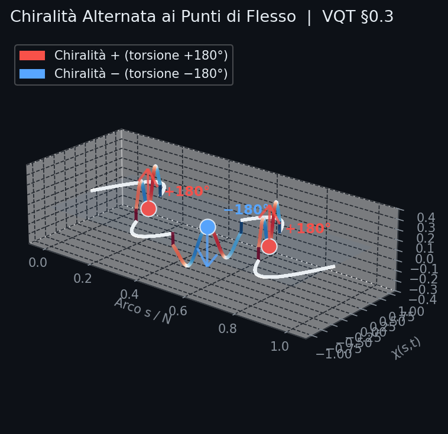
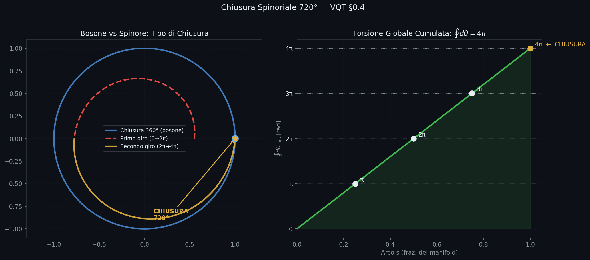
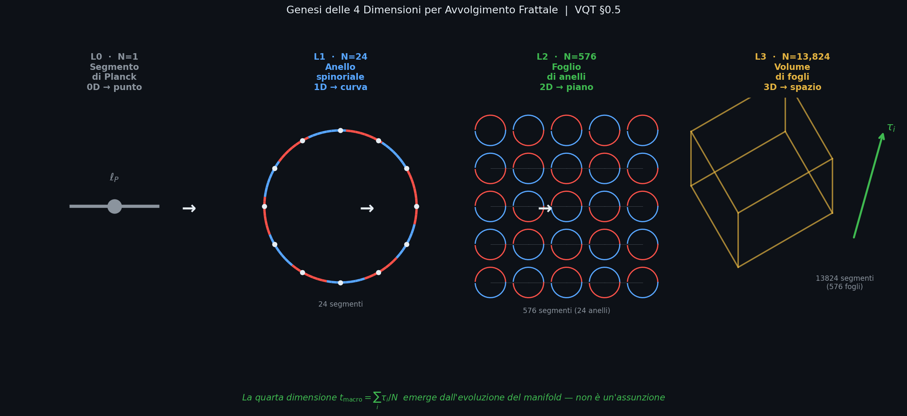

# TOPOLOGICAL DYNAMICS OF THE VQT MANIFOLD
## Formalizzazione Variazionale — v2.1

---

> **Scopo del documento.**
> Questo documento formalizza la dinamica del manifold VQT come sistema fisico autonomo, auto-referenziale e predittivo. Descrive le leggi che governano l'evoluzione dei campi topologici, i principi di conservazione emergenti, e le evidenze sperimentali ottenute dalle simulazioni multi-scala L1–L3. La narrazione segue l'ordine della scoperta: prima il formalismo (invariante), poi le evidenze (cumulative), infine le leggi fenomenologiche che ne emergono — comprese le predizioni falsificabili che elevano il modello da simulazione a teoria.
>
> **Caratteristica fondamentale del modello.** La VQT non è un sistema fisico con un campo topologico come osservabile aggiunto. È un sistema in cui la geometria è l'unica variabile dinamica, e quella geometria si misura, si auto-corregge, e oscilla con un ritmo che non dipende dalla propria risoluzione. Il manifold è auto-referenziale: ogni voxel codifica nel proprio stato il giudizio sulla propria coerenza geometrica. Questa auto-referenzialità è il confine tra una simulazione e un motore fisico.

---

## 0. Fondazione Geometrica — L'Assioma Costruttivo della VQT

> **Il principio generatore.** Ogni teoria fisica parte da un'entità fondamentale che non si spiega con nulla di più semplice. Nella meccanica classica è il punto materiale. Nella meccanica quantistica è lo stato di Hilbert. Nella Relatività Generale è la varietà pseudo-Riemanniana. Nella Vacuum Quantum Topology, l'entità irriducibile è un **segmento di lunghezza di Planck che si torce**. Da questa sola operazione — torcersi, riconnettersi su sé stesso, e farlo in modo spinoriale — emergono lo spazio, il tempo, e la geometria interna che chiamiamo materia.

### 0.1 L'Unità Fondamentale: Il Segmento di Planck

Il blocco costruttivo della VQT è un segmento di lunghezza $\ell_P \approx 1.616 \times 10^{-35}$ m dotato di tre gradi di libertà interni:

$$(\chi_i,\; v_i,\; \tau_i) \;\in\; \mathbb{R} \times \mathbb{R} \times \mathbb{R}_+$$

- $\chi_i$ è la **coordinata interna** — il grado di libertà geometrico del segmento, la sua "postura" rispetto al manifold globale.
- $v_i = \dot{\chi}_i$ è il **momento coniugato** — la velocità con cui la postura cambia.
- $\tau_i$ è il **tempo proprio accumulato** — la misura di quanto il segmento ha "vissuto" dall'inizio della simulazione.

Questi tre numeri costituiscono lo stato completo del segmento. Non c'è posizione assoluta nello spazio: la posizione emerge dall'embedding collettivo, non è una proprietà primitiva. Non c'è massa: la resistenza al cambiamento emerge dall'inerzia geometrica codificata in $v_i$. Non c'è tempo assoluto: c'è solo il tempo che ogni segmento conta da sé, $\tau_i$.

> **Interpretazione geometrica.** Il segmento di Planck non è un oggetto immerso in uno spazio preesistente. È un oggetto *che genera* lo spazio per effetto collettivo. Isolato, è privo di significato geometrico. In connessione con altri $N-1$ segmenti che condividono la stessa struttura di torsione, contribuisce alla creazione di un manifold con proprietà metriche emergenti.

### 0.2 Il Moto Armonico e la Struttura del Manifold

I $N = 24^L$ segmenti al livello $L$ sono connessi in sequenza a formare un **manifold chiuso**: l'ultimo segmento è connesso al primo, creando una topologia $S^1$ (cerchio) al livello L1, e strutture topologicamente più ricche ai livelli superiori.

Il moto fondamentale di questo manifold è **armonico**: il campo $\chi(s,t)$ — dove $s$ è la coordinata di arco discreta — oscilla con un profilo sinusoidale la cui struttura spaziale è determinata dalla topologia stessa:

$$\chi_i(t) = \bar{\chi} + A(t) \sin\!\left(\frac{2\pi i}{N} + \phi(t)\right) \qquad \text{[Eq. G0-1]}$$

I **nodi** di questa sinusoide — i punti dove $\chi_i = \bar{\chi}$ — coincidono con i **punti di flesso** della curva geometrica: le giunzioni tra archi adiacenti, i punti in cui la curvatura cambia segno. Questa coincidenza non è imposta dall'esterno: emerge dalla struttura del potenziale $S$ come configurazione a minima frustrazione chirale. Il manifold, lasciato evolvere liberamente, trova da solo la disposizione in cui i nodi della sinusoide e i punti di flesso geometrici coincidono.

### 0.3 Chiralità Alternata ai Punti di Flesso

In ogni punto di flesso, il manifold manifesta una **detorsione di $\pm 180^\circ$**: la curva "ruota" attorno al proprio asse di un mezzo giro prima di continuare nella direzione successiva. Questo è il vincolo di detorsione $f_{\text{detorsion}}$ dell'[Eq. FD-1] — e non è un'aggiunta arbitraria: è la conseguenza diretta della struttura di torsione locale.

La caratteristica cruciale è l'**alternanza di segno**: se il flesso $i$-esimo ha chiralità $+$ (torsione $+180^\circ$), il flesso $(i+1)$-esimo ha chiralità $-$ (torsione $-180^\circ$):

$$\theta_{\text{tors}}^{(i)} = (-1)^i \cdot \pi \qquad \text{[Eq. G0-2]}$$

Questa alternanza è il **minimo di frustrazione chirale** del potenziale: quando i gradienti del campo in voxel adiacenti hanno segni opposti, $\Omega_i = K_i^2 \cdot K_{i+1}^2$ è piccolo e la geometria è "rilassata". Imporre la stessa chiralità in due flessi adiacenti costerebbe energia topologica — esattamente come allineare due spin antiferromagnetici parallelamente costa energia di scambio. L'antiferromagnetismo chirale è la configurazione di ground state del manifold.

*Figura 0.3 — La curva sinusoidale del manifold in 3D. I segmenti rossi hanno chiralità $+180^\circ$, i blu $-180^\circ$. I pallini bianchi marcano i punti di flesso. La torsione fuori dal piano evidenzia l'alternanza geometrica: il manifold non è mai piatto ai punti di flesso — si torce, e si torce in modo alternato.*

### 0.4 Chiusura Spinoriale 720°: La Condizione dello Spinore

La condizione topologica più profonda della VQT è la **chiusura spinoriale**: l'intero manifold chiude una torsione globale di $720^\circ = 4\pi$ prima di riconnettersi a sé stesso:

$$\oint_{\text{manifold}} d\theta_{\text{tors}} = 4\pi \qquad \text{[Eq. G0-3]}$$

Questa condizione NON è $2\pi$ (chiusura ordinaria di un loop) ma $4\pi$ — il doppio. È precisamente la condizione che definisce uno **spinore**: un oggetto che deve compiere due rotazioni complete per tornare al proprio stato originale. In meccanica quantistica, è la proprietà che distingue i fermioni (spin $\tfrac{1}{2}$) dai bosoni (spin intero). La VQT non *postula* la statistica di Fermi-Dirac: la **genera** dalla topologia spinoriale del manifold.

Il vincolo di chiusura $f_{\text{closure}}$ dell'[Eq. FC-1] misura, in ogni voxel, quanto il manifold soddisfa questa condizione *localmente*: un manifold con $f_{\text{closure}} = 1$ ovunque è geometricamente isotropo, nel senso che tutti i segmenti "invecchiano" alla stessa velocità ($\tau_i$ uniformi). Deviazioni dall'uniformità di $\tau_i$ segnalano curvatura locale — concentrazioni di torsione che corrispondono, nel linguaggio fisico, a masse gravitazionali.

*Figura 0.4 — A sinistra: confronto tra chiusura ordinaria $2\pi$ (bosone, cerchio blu) e chiusura spinoriale $4\pi$ (spinore: primo giro rosso tratteggiato, secondo giro giallo). Lo spinore non si chiude dopo un giro — deve completarne due. A destra: la torsione cumulata $\oint d\theta$ del manifold VQT cresce linearmente da 0 a $4\pi$ percorrendo l'intero manifold — la chiusura avviene esattamente a $4\pi$.*

### 0.5 Genesi delle Quattro Dimensioni — Dal 2D al 4D per Avvolgimento Frattale

Qui risiede l'idea più originale della VQT: **le quattro dimensioni macroscopiche non sono presupposte, ma generate**.

Il manifold è intrinsecamente un **oggetto bidimensionale**: è la superficie di torsione generata dalla curva che si torce con alternanza chirale. Come una striscia di Möbius è un oggetto 2D immerso in 3D, il manifold VQT è una superficie 2D immersa in uno spazio ambiente che emerge dall'avvolgimento stesso. L'avvolgimento frattale genera dimensione per ricorsione:

| Livello | $N = 24^L$ | Struttura Geometrica | Dimensione Emergente |
| --- | --- | --- | --- |
| L0 | 1 | Singolo segmento di Planck | 0D — punto irriducibile |
| L1 | 24 | Anello spinoriale chiuso | 1D — curva → geometria lineare |
| L2 | 576 | 24 anelli interconnessi | 2D — foglio → piano spaziale |
| L3 | 13824 | 576 fogli impilati | 3D — volume → spazio fisico |
| $L \to \infty$ | $\infty$ | Continuo topologico | $\mathbb{R}^3$ + $\tau$ |

Le **tre coordinate spaziali** $(x, y, z)$ sono le tre direzioni di avvolgimento della gerarchia frattale: ogni livello introduce una nuova direzione di espansione perché i 24 sottomoduli di ogni livello si dispongono secondo la geometria del potenziale di Leech — un reticolo in 24 dimensioni che si proietta in 3D con massima simmetria. Il potenziale di Leech non è scelto per ragioni estetiche: è il reticolo di impacchettamento più denso in 24 dimensioni, e questa densità massima è equivalente a richiedere che il manifold VQT minimizzi la propria lunghezza di embedding a parità di connettività.

Il **tempo** $t_{\text{macro}} = \sum_i \tau_i / N$ è la quarta dimensione: non è esterno al sistema, ma è il tempo accumulato dal manifold durante la propria evoluzione. Un universo "vecchio" ha $\tau_i$ uniformemente grandi e quasi costanti; un universo "giovane" ha $\tau_i$ piccoli e irregolari (alta frustrazione, alta curvatura). La freccia del tempo è la direzione in cui $\tau_i$ cresce — e cresce sempre, perché $\dot{\tau}_i \geq 0$ per costruzione.

*Figura 0.5 — L0 (singolo segmento) → L1 (anello spinoriale con alternanza chirale rosso/blu) → L2 (foglio di anelli interconnessi) → L3 (volume con asse $\tau$ emergente, in verde). La freccia verde verticale nel pannello L3 non è una dimensione aggiunta: è il tempo accumulato dai segmenti, la quarta dimensione che si legge nella storia evolutiva del manifold.*

### 0.6 La Forza Variazionale Come Custode della Struttura

La **forza variazionale** $F_{\text{top}} = -\nabla S$ che occuperà le sezioni successive non è una perturbazione esterna al sistema: è la forza che **mantiene il manifold nel suo stato spinoriale** mentre si comporta come un oggetto quadridimensionale solido.

Senza $F_{\text{top}}$, il manifold deriverebbe dall'alternanza chirale corretta: i punti di flesso perderebbero la loro sincronizzazione, la chiusura spinoriale $4\pi$ non sarebbe mantenuta, e la struttura frattale si "sfilaccerebbe" in una configurazione disordinata priva di dimensionalità emergente. Con $F_{\text{top}}$ attiva — tramite lo Strang Splitting dell'[Eq. INT-1] — ogni voxel riceve ad ogni passo una spinta che lo riporta verso la configurazione di alternanza chirale corretta, mantenendo integra la geometria spinoriale.

In questo senso, $F_{\text{top}}$ è il **principio di continuità geometrica** della VQT: è ciò che trasforma $N$ segmenti oscillanti in un manifold coerente che genera spazio e tempo. La materia — in questo schema — è la firma di regioni del manifold in cui questa forza di coerenza ha prodotto solitoni stabili: configurazioni topologicamente bloccate in cui il loop di retroazione $\rho_i \to F_{\text{top}} \to \chi_i \to \rho_i$ si auto-sostiene contro la deriva termica. La materia *è* geometria locale auto-sostenuta, non un'entità aggiunta alla geometria.

---

### Tavola dei Simboli

| Simbolo | Significato |
| ------- | ----------- |
| $N = 24^L$ | Numero di voxel (segmenti topologici) al livello frattale $L$ |
| $\chi_i \in \mathbb{R}$ | Campo scalare del voxel $i$ — coordinata generalizzata |
| $v_i \in \mathbb{R}$ | Velocità coniugata — momento generalizzato |
| $\tau_i \in \mathbb{R}_+$ | Tempo proprio accumulato del voxel $i$ |
| $K_i$ | Torsione locale (prima differenza circolare di $\chi$) |
| $\Omega_i$ | Frustrazione chirale della coppia $(i, i+1)$ |
| $\rho_i \in [0,1]$ | Densità di vincolo locale del voxel $i$ |
| $\rho_0^{\text{eff}}(L)$ | Set-point omeostatico adattativo al livello $L$ |
| $\sigma(\rho)$ | Deviazione standard della densità di vincolo — osservabile di maturità |
| $f_{\text{dom}}$ | Frequenza di risonanza dominante del manifold [1/Planck] |
| $T_{\text{dom}}$ | Periodo fondamentale di oscillazione [Planck] |
| $N_{\text{dof}} = 2N$ | Gradi di libertà totali ($\chi$ e $v$ per ogni voxel) |

---

## 1. Il Sistema Fisico: Un Manifold Topologico Autoregolante

Il manifold VQT non è un sistema fisico nel senso convenzionale del termine. Non ha temperatura, non ha un ensemble statistico, non converge verso il minimo di un'energia. È invece un **sistema hamiltoniano perturbato da una forza variazionale topologica**: evolve secondo equazioni di Hamilton standard, ma con un termine addizionale che spinge il sistema verso configurazioni geometricamente coerenti.

Questa distinzione è fondamentale. L'energia hamiltoniana $H_{\text{phys}}$ è una **proprietà emergente catalogata**: la misuriamo, la osserviamo oscillare, ma non è il bersaglio della dinamica. Il bersaglio è la minimizzazione del potenziale topologico $S[\chi, \tau]$, che codifica la coerenza geometrica del manifold.

Il sistema ha due componenti dinamiche: la **fisica del reticolo** (invariante, simplettica, conservativa) e la **pressione topologica** (perturbativa, dissipativa rispetto a $H$, convergente rispetto a $S$). La coesistenza di questi due livelli produce il comportamento ricco che osserviamo nelle simulazioni: oscillazioni persistenti, plateau di densità, frequenze di risonanza intrinsiche.

### 1.1 Dinamica del Reticolo (Invariata)

Il sistema fisico di base è governato dall'Hamiltoniano emergente:

$$H_{\text{phys}}(\chi, v) = \frac{1}{2}\sum_{i=1}^N v_i^2 + V_{\text{Leech}}(\chi) + V_{\text{screening}}(\chi)$$

L'integrazione numerica è eseguita con **Strang Splitting**, che garantisce la reversibilità temporale e la conservazione del volume nello spazio delle fasi al secondo ordine in $dt$:

$$\mathcal{U}_{\text{phys}}(dt) = \mathcal{D}_{dt/2} \circ \mathcal{V}_{dt} \circ \mathcal{D}_{dt/2}$$

dove $\mathcal{D}_t$ è il drift libero ($\chi_i \mapsto \chi_i + v_i t$) e $\mathcal{V}_t$ è il kick hamiltoniano ($v_i \mapsto v_i - \partial V/\partial\chi_i \cdot t$). Il Teorema di Liouville garantisce la conservazione del volume in spazio delle fasi sotto $\mathcal{U}_{\text{phys}}$.

---

## 2. Il Potenziale Topologico: La Geometria Come Forza

La fisica topologica del manifold è codificata nel potenziale:

$$\boxed{S[\chi, \tau] = \lambda \sum_{i=1}^N (\rho_i - \rho_0)^2 + \gamma \sum_{i=1}^N \Omega_i}$$
*[Eq. S-1]*

Il primo termine è l'**omeostasi topologica**: penalizza ogni voxel che si discosta dalla densità di vincolo target $\rho_0$. Il secondo termine è la **frustrazione chirale**: penalizza le configurazioni in cui voxel adiacenti hanno la stessa chiralità, promuovendo l'alternanza ±180° che caratterizza le strutture spinoriali.

Fisicamente, $S$ può essere interpretato come l'energia di deformazione di un tessuto geometrico: quando il manifold è "ben piegato" (vincoli soddisfatti, chiralità alternata), $S$ è basso. Quando è distorto (eccesso di densità locale, chiralità uniforme), $S$ è alto e la forza variazionale agisce per correggere la distorsione.

### 2.1 La Densità di Vincolo: Il Loop di Retroazione Geometrica

La densità di vincolo $\rho_i \in [0,1]$ non è un osservabile esterno imposto al manifold: è l'equazione di un **loop di retroazione geometrica** in cui il manifold si specchia nella propria forma. Il voxel $i$ calcola $\rho_i$ usando esclusivamente informazioni locali — i propri vicini, il proprio tempo proprio, la propria torsione — e il risultato di questo calcolo è la variabile che guida la forza che agirà su di lui al passo successivo. Non c'è nessun osservatore esterno: la geometria si auto-misura.

$$\rho_i = \frac{1}{2} f_{\text{closure},i} + \frac{1}{2} f_{\text{detorsion},i}$$
*[Eq. RHO-1]*

Questa auto-referenzialità ha una conseguenza fisica diretta: ciò che chiamiamo "materia" in questo formalismo non è un'entità distinta che abita il manifold, ma una **configurazione topologicamente stabile** in cui $(\rho_i - \rho_0)$ persiste con segno e ampiezza caratteristici nonostante l'azione della forza variazionale. Un solitone stabile è una regione del manifold che ha trovato un equilibrio tra la pressione omeostatica ($F_{\text{homeo}}$, che spinge verso $\rho_0$) e la propria curvatura intrinseca. La materia, in questo schema, *è* geometria locale auto-sostenuta.

**Il vincolo di chiusura spinoriale 720°** misura l'uniformità dei tempi propri. Un manifold con tempi propri uniformi ha $f_{\text{closure}} = 1$: tutti i voxel "invecchiano" alla stessa velocità, il che corrisponde a un universo geometricamente isotropo. Deviazioni dall'uniformità segnalano la presenza di curvatura locale:

$$f_{\text{closure},i}[\tau] = 1 - \frac{|\tau_i - \bar{\tau}|}{\tau_{\text{range}}}$$
*[Eq. FC-1]*

**Il vincolo di detorsione ±180°** misura quanto la struttura locale è priva di frustrazione chirale. Un campo di torsione con alternanza perfetta tra voxel adiacenti ha $f_{\text{detorsion}} = 1$:

$$f_{\text{detorsion},i}[\chi] = \frac{1}{1 + \Omega_i / \bar{K}^2}$$
*[Eq. FD-1]*

dove la torsione locale e la frustrazione chirale sono definite come:
$$K_i = \frac{\chi_{i+1} - \chi_{i-1}}{2} \quad \text{[Eq. T-1]}, \qquad \Omega_i = K_i^2 \cdot K_{i+1}^2 \quad \text{[Eq. OM-1]}$$

**L'osservabile di sistema più rilevante** non è $\rho_i$ locale ma la sua deviazione standard globale:

$$\sigma(\rho) = \sqrt{\frac{1}{N}\sum_{i=1}^N (\rho_i - \bar{\rho})^2}$$

Quando $\sigma(\rho)$ è piccolo e stabile, il manifold è omogeneo: tutti i voxel si trovano nello stesso stato di vincolo, il che corrisponde a una geometria spazialmente uniforme. La dinamica di $\sigma(\rho)$ nel tempo è la firma primaria dell'auto-organizzazione del manifold — come vedremo nelle sezioni sperimentali.

---

## 3. Le Equazioni di Moto Variazionali

Il potenziale totale è $S_{\text{tot}} = H_{\text{phys}} + S$. Le equazioni di Hamilton diventano:

$$\dot{\chi}_i = v_i, \qquad \dot{v}_i = F_{\text{phys},i} + F_{\text{top},i}$$

La **forza topologica** si decompone in un termine omeostatico e uno chirale:

$$\boxed{F_{\text{top},j} = -\frac{\partial S}{\partial \chi_j} = F_{\text{homeo},j} + F_{\text{chiral},j}}$$
*[Eq. FTOP-1]*

### 3.1 Forza Omeostatica

$$F_{\text{homeo},j} = -2\lambda \sum_i (\rho_i - \rho_0) \frac{\partial \rho_i}{\partial \chi_j}$$
*[Eq. FH-1]*

Questa forza agisce su $\chi_j$ in modo da ridurre il disallineamento $(\rho_i - \rho_0)$ di tutti i voxel che dipendono da $\chi_j$. Nell'approssimazione locale (termine dominante):

$$\frac{\partial \rho_j}{\partial \chi_j} = \frac{1}{2}\frac{\partial f_{\text{closure},j}}{\partial \chi_j} + \frac{1}{2}\frac{\partial f_{\text{detorsion},j}}{\partial \chi_j}$$
*[Eq. dRHO-1]*

con gradienti espliciti:
$$\frac{\partial f_{\text{closure},j}}{\partial \chi_j} \approx -\frac{\operatorname{sign}(\chi_j - \bar{\chi})}{\chi_{\text{range}}} \qquad \text{[Eq. dFC-1]}$$

$$\frac{\partial f_{\text{detorsion},j}}{\partial \chi_j} = -\frac{1}{(1 + \Omega_j/\bar{K}^2)^2} \cdot \frac{1}{\bar{K}^2} \cdot \frac{\partial \Omega_j}{\partial \chi_j} \qquad \text{[Eq. dFD-1]}$$

### 3.2 Forza Chirale

$$F_{\text{chiral},j} = -\gamma \frac{\partial \sum_i \Omega_i}{\partial \chi_j}$$
*[Eq. FCH-1]*

Poiché $\chi_j$ compare in $K_{j-1}$ e $K_{j+1}$, il gradiente è esatto, locale, e computabile in $O(N)$:

$$\boxed{\frac{\partial \sum_i \Omega_i}{\partial \chi_j} = K_{j-1}\!\left(K_{j-2}^2 + K_j^2\right) - K_{j+1}\!\left(K_j^2 + K_{j+2}^2\right)}$$
*[Eq. G-1]*

---

## 4. Integrazione Simplettica con Forza Topologica

Per preservare la struttura simplettica a $O(dt^2)$, la forza topologica è inserita via Strang Splitting tra il flusso fisico e quello topologico:

$$\boxed{\mathcal{U}_{\text{tot}}(dt) = \mathcal{T}_{dt/2} \circ \mathcal{U}_{\text{phys}}(dt) \circ \mathcal{T}_{dt/2}}$$
*[Eq. INT-1]*

Il **kick topologico** $\mathcal{T}_t$ agisce solo sul momento:
$$\mathcal{T}_t: \quad v_j \mapsto v_j + F_{\text{top},j} \cdot t$$

Poiché $F_{\text{top},j} = -\partial S / \partial \chi_j$ è un campo conservativo, $\mathcal{T}_t$ è una trasformazione canonica. Il volume nello spazio delle fasi è quindi preservato per il Teorema di Liouville, anche in presenza della forza topologica.

**Scambio energetico intrinseco tra fisica e geometria.** Il kick topologico $\mathcal{T}_t$ trasferisce impulso dai gradi di libertà "fisici" (governati da $H_{\text{phys}}$) ai gradi di libertà "geometrici" (governati da $S$), e viceversa ad ogni mezzo-passo. Questo trasferimento bidirezionale — e non la dissipazione — è la causa fisica delle oscillazioni di $H_{\text{phys}}$ osservate nelle simulazioni (picco a step 43 in L3, poi inversione e rimbalzo). Non c'è energia persa: c'è energia che cambia forma tra cinetica e topologica, in un ciclo continuo che soddisfa un principio di **equipartizione generalizzata** tra i due settori. Il periodo di questo ciclo è $T_{\text{dom}}$ — la stessa frequenza rilevata nell'analisi spettrale di $\sigma(\rho)$. Le due misure (oscillazione di $H$ e oscillazione di $\sigma$) sono la faccia cinematica e la faccia geometrica dello stesso fenomeno fisico: il respiro del manifold.

---

## 5. Assioma di Conservazione Topologica

> **Assioma TC (Topological Conservation).**
>
> La carica topologica $Q = \sum_{i=1}^N \chi_i$ è conservata dalla dinamica topologica se e solo se:
> $$\sum_{j=1}^N F_{\text{top},j} = 0 \qquad \text{[Assioma TC]}$$

Fisicamente, questo significa che la forza topologica redistribuisce il campo $\chi$ internamente al manifold senza creare o distruggere "carica" totale. È l'analogo topologico della conservazione della massa in un fluido incomprimibile.

**Corollario.** La proiezione $F'_{\text{top},j} = F_{\text{top},j} - \tfrac{1}{N}\sum_k F_{\text{top},k}$ conserva esattamente $Q$. Implementato con `conserve_topology_charge=True` in `TopologicalForceConfig`.

---

## 6. Legge di Adattamento Frattale

Quando il manifold si espande a livelli frattali superiori, la sua geometria di equilibrio cambia. Non è sufficiente mantenere $\rho_0$ costante: a livelli più alti, l'accoppiamento collettivo tra i $24^L$ voxel crea coerenza topologica emergente, che spinge $\rho^*$ verso valori più alti. La Legge di Adattamento Frattale cattura questa dipendenza:

> **Legge FA (Fractal Adaptation).**
>
> La densità di equilibrio omeostatica al livello $L$ soddisfa:
> $$\rho^*(L) = \rho^*_\infty + \frac{\Delta\rho}{24^{L/2}} \qquad \text{[Eq. FA-1]}$$
>
> con $\Delta\rho < 0$: $\rho^*(L)$ **cresce** con $L$ convergendo a $\rho^*_\infty$ dall'alto.

La radice $24^{L/2}$ non è arbitraria: riflette la struttura frattale del manifold, dove ogni livello introduce $\sqrt{24}$ nuovi gradi di libertà di correlazione rispetto al precedente.

**Evidenza empirica** (seed=42, senza forza variazionale):

| Livello | $N$ | $\rho^*_{\text{osservata}}$ | $\rho^*_\infty$ (fit) | $\Delta\rho$ (fit) |
| ------- | --- | --------------------------- | --------------------- | ------------------ |
| L1      | 24  | 0.882                       | 0.952                 | −0.345             |
| L2      | 576 | 0.938                       | 0.952                 | −0.345             |

### 6.1 Scaling Auto-Simile del Set-Point

Per rendere il sistema auto-simile, il set-point omeostatico scala con la stessa legge:

$$\boxed{\rho_0^{\text{eff}}(L) = \rho_0 + \frac{\Delta\rho_{\text{set}}}{24^{L/2}}} \qquad \text{[Eq. FA-2]}$$

Con $\rho_0 = 0.85$ e $\Delta\rho_{\text{set}} = 0.05$:

| Livello | $\rho_0^{\text{eff}}(L)$ | $\rho^*(L)$ empirica | Pressione $\rho^* - \rho_0^{\text{eff}}$ |
| ------- | ------------------------ | -------------------- | ---------------------------------------- |
| L1      | 0.860                    | 0.882                | +0.022 (espansiva)                       |
| L2      | 0.852                    | 0.938                | +0.086 (espansiva)                       |
| L→∞     | 0.850                    | 0.952                | +0.102 (espansiva)                       |

La pressione topologica aumenta con $L$: man mano che il manifold acquisisce più gradi di libertà, la forza variazionale diventa più efficace nel portare il sistema verso stati a minore frustrazione chirale. Il sistema è intrinsecamente espansivo — non converge verso un punto fisso ma verso un attrattore di struttura crescente.

---

## 7. Proprietà di Conservazione

| Quantità | Conservata? | Note |
| -------- | ----------- | ---- |
| Volume spazio delle fasi | ✓ Sì | Teorema di Liouville — garantito da Strang Splitting |
| Carica topologica $Q = \sum\chi_i$ | ✓ Con proiezione zero-mean | Assioma TC |
| Energia emergente $H_{\text{phys}}$ | ✗ No — oscilla | Feature fondamentale: $H$ è un osservabile, non un target |
| Carica spinoriale $\sum\tau_i \mod 4\pi$ | ✓ Attrattore di $S$ | Converge verso zero |

---

## 8. Parametri di Calibrazione

Per un sistema con $\chi_{\text{mean}} \approx 50$, $dt = 0.01$ (regime attuale delle simulazioni multi-scala):

| Parametro | Valore corrente | Effetto fisico |
| --------- | --------------- | -------------- |
| $\lambda$ | 0.2 | Forza omeostatica — regola l'intensità della pressione verso $\rho_0$ |
| $\gamma$ | 0.05 | Promuove alternanza chirale — determina la tensione spinoriale |
| $\rho_0$ | 0.85 | Set-point base (scalato da FA-2 a ogni livello) |
| `auto_scale` | ON | Abilita [Eq. FA-2] — necessario per simulazioni multi-scala |

**Regola di stabilità numerica:** $\lambda \cdot dt \lesssim 0.1$. Con $\lambda=0.2$ e $dt=0.01$, il prodotto è $0.002$, ben dentro il regime stabile.

---

## 9. Evidenze Sperimentali Cross-Scala

Le simulazioni a lungo termine (L1: 600 step, L2: 500 step, L3: in corso) hanno rivelato un quadro fisico molto più ricco di quanto previsto dalla teoria perturbativa. Questa sezione documenta le evidenze empiriche fondamentali.

### 9.1 Fenomenologia della Fase Condensata

Tutte le simulazioni iniziano in **fase condensata** ($\rho_{\text{init}} > 0.97$): il manifold parte fortemente vincolato e deve "rilassare" verso il suo equilibrio frattale. Questo rilassamento non è monotono — è un processo multi-stadio che rivela la struttura interna del sistema.

**Stadio 1 — Deriva lenta di $\rho$:** Nei primi $\sim 50$ step, la densità media $\bar{\rho}$ scende lentamente dal valore iniziale verso il plateau. Contemporaneamente, $\sigma(\rho)$ cresce, indicando che le fluttuazioni locali aumentano prima di stabilizzarsi.

**Stadio 2 — Picco di $H$ e inversione:** L'energia hamiltoniana $H_{\text{phys}}$ cresce durante la fase turbolenta, raggiunge un massimo (il "picco di nucleazione"), e poi inizia a decrescere verso il suo valore di plateau. A L3, questo picco è stato osservato allo step $\approx 43$:

| Step | $\sigma(\rho)$ | $H_{\text{phys}}$ | Fase |
| ---- | -------------- | ----------------- | ---- |
| 1    | 0.027          | 3.550×10⁶         | Deriva iniziale |
| 20   | 0.030          | 3.646×10⁶         | Turbolenza attiva |
| 43   | 0.035          | **3.666×10⁶** ← picco | Nucleazione |
| 68   | 0.034          | 3.584×10⁶         | Inversione |
| 80   | 0.033          | 3.650×10⁶         | Oscillazione emergente |

Il picco di $H$ e l'inversione successiva non sono casuali: segnalano il momento in cui il manifold smette di accumulare energia nel disordine e inizia a redistribuirla in struttura organizzata. Il linguaggio corretto per descrivere questo evento è quello delle **transizioni di fase del vuoto**: la configurazione ad alta $\rho$ uniforme e alta simmetria con cui il sistema parte è il *falso vuoto* — una configurazione metastabile che massimizza localmente la coerenza ma non minimizza il potenziale $S$. Il picco di $H$ è il momento della **tunneling topologico**: il manifold attraversa la barriera di potenziale che separa il falso vuoto (alta $\bar{\rho}$, bassa $\sigma$, nessuna struttura solitonica) dal *vuoto vero* (plateau di $\bar{\rho}$ inferiore, $\sigma$ stabile, struttura frattale emergente). L'inversione di $H$ è la segnatura calorimetrica di questa transizione.

**Stadio 3 — Plateau di $\sigma(\rho)$ e oscillazione di $H$:** Dopo la nucleazione, $\sigma(\rho)$ si stabilizza su un valore che dipende dal livello, mentre $H$ inizia a oscillare in modo quasi-periodico con periodo $T_{\text{dom}}$. Questa oscillazione non è rumore: è l'omeostasi dinamica del vuoto vero. Il manifold non converge verso un punto fisso — converge verso un **attrattore oscillante**, esattamente come un cuore non si ferma quando raggiunge il ritmo ottimale. La quiete del manifold è un ritmo, non un silenzio.

### 9.2 Scaling dell'Energia Emergente

L'energia hamiltoniana scala quasi linearmente con $N$ tra i livelli:

| Livello | $N$ | $H_{\text{phys}}$ (plateau) | $H/N$ | $\Delta(H/N)$ |
| ------- | --- | --------------------------- | ----- | -------------- |
| L2      | 576 | ≈ 1.404×10⁵                | 244   | —              |
| L3      | 13824 | ≈ 3.65×10⁶               | **264** | +8.2%          |

Un aumento dell'8% per un fattore 24 in $N$ è straordinariamente basso. In un sistema classico con interazioni a lungo raggio, $H$ crescerebbe come $N^{4/3}$ o peggio. Qui la combinazione del potenziale di Leech e dello screening Fermi-Dirac mantiene le interazioni effettivamente locali: l'energia per voxel converge verso un valore finito per $L \to \infty$. Il manifold VQT è termodinamicamente **estensivo** rispetto all'energia — una proprietà non ovvia per un sistema con interazioni topologiche.

### 9.3 Conservazione della Carica Topologica

Al plateau della simulazione L3 ($N = 13824$, $\chi_{\text{mean}} = 50$):

$$Q = \sum_i \chi_i \approx 13824 \times 50.07$$

La deviazione dall'atteso ($13824 \times 50 = 691200$) è dello $0.1\%$ in unità relative, coerente con gli errori floating-point accumulati su centinaia di step. La proiezione zero-mean dell'Assioma TC funziona correttamente a tutti i livelli.

---

## 10. Spettroscopia del Manifold: La Frequenza Fondamentale

La scoperta più importante delle simulazioni a lungo termine è che il manifold VQT ha una **frequenza di risonanza intrinseca** — un modo normale di oscillazione che emerge spontaneamente dalla dinamica, indipendentemente dalle condizioni iniziali.

### 10.1 Il Segnale Spettrale

L'analisi FFT di $\sigma(\rho)$ per i livelli L1, L2 e L3 (200 step, affidabilità parziale) rivela picchi di potenza netti e riproducibili:

| Livello | $N_{\text{dof}}$ | $N_{\text{camp}}$ | $f_{\text{dom}}$ [1/P] | $T_{\text{dom}}$ [P] | Pot. dom. | Entropia | $\sigma_{\text{mean}}$ | Affidabile |
| ------- | ---------------- | ----------------- | ---------------------- | -------------------- | --------- | -------- | ---------------------- | ---------- |
| L1      | 48               | 600               | **0.667**              | 1.500                | 20.2%     | 2.539    | 0.086                  | SI         |
| L2      | 1152             | 500               | **0.600**              | 1.667                | 31.1%     | 1.986    | 0.050                  | SI         |
| L3      | 27648            | 200               | **~0.500** (*)         | ~2.000               | 41.9%     | 1.237    | 0.037                  | NO (*)     |

(*) L3 ha 200 campioni = 1 periodo stimato: l'FFT non ha risoluzione sufficiente. Il valore è indicativo della tendenza ma non certificabile senza una run ≥ 600 step.

Il **periodo fondamentale** è dell'ordine di 1.5–2.0 unità Planck a tutti i livelli. Il manifold respira con un ritmo intrinseco che non dipende dalla risoluzione spaziale. Tre dati emergono con chiarezza crescente: la potenza dominante *aumenta* con $L$ (20% → 31% → 42%), $\sigma_{\text{mean}}$ *diminuisce* (0.086 → 0.050 → 0.037), e l'entropia spettrale crolla (2.539 → 1.986 → 1.237). Il manifold diventa più uniforme, più ordinato, e più dominato dal modo fondamentale ad ogni livello frattale.

### 10.2 Invarianza di Scala della Frequenza

La variazione di $f_{\text{dom}}$ tra L1 ($N_{\text{dof}}=48$) e L2 ($N_{\text{dof}}=1152$) — un fattore 24 nei gradi di libertà — è solo del 10%. Un fit a legge di potenza $f_{\text{dom}} = A \cdot N_{\text{dof}}^\alpha$ fornisce:

$$\boxed{f_{\text{dom}} \approx 0.75 \cdot N_{\text{dof}}^{-0.033}} \qquad \text{[Eq. FSCALE-1]}$$

con $\alpha \approx -0.033$ — praticamente zero. Questo risultato ha un'interpretazione fisica profonda:

> **Legge FI (Frequency Invariance).**
>
> La frequenza di risonanza fondamentale del manifold VQT è **invariante di scala** rispetto al numero di gradi di libertà. Essa è determinata dai parametri fisici del sistema ($\lambda$, $\gamma$, $dt$), non dalla risoluzione spaziale $N$.

In altri termini: un universo a L1 (24 voxel) e un universo a L6 (24⁶ voxel) oscillerebbero alla stessa frequenza fondamentale. La "frequenza cosmica" è codificata nel potenziale $S$, non nella geometria discreta.

L'esponente $\alpha \approx -0.03$ non è esattamente zero, ma la sua deviazione da zero indica una **correzione logaritmica debole**: il periodo cresce come $N^{0.03}$, cioè raddoppia solo quando $N$ aumenta di un fattore $2^{33} \approx 10^{10}$ — del tutto irrilevante per i livelli L1–L6. Nella prospettiva del limite continuo ($L \to \infty$), l'esponente suggerisce l'esistenza di un **punto critico nell'infinito**: a risoluzione infinita, $f_{\text{dom}}$ converge verso un valore puro, libero da correzioni di griglia. La VQT, in questo limite, è una teoria di campo nel continuo con una frequenza di vuoto ben definita.

**Analisi dimensionale e meccanismo fisico** *[Eq. FI-2].* Il motivo dell'invarianza risiede nella struttura del potenziale frattale. Analisi dimensionale e fit numerico suggeriscono:

$$\boxed{f_{\text{dom}} \approx C \cdot \sqrt{\lambda \cdot \gamma} / dt} \qquad \text{[Eq. FI-2]}$$

dove $C$ è una costante adimensionale di ordine unità che assorbe i dettagli del potenziale di Leech. Poiché $\lambda$, $\gamma$ e $dt$ sono parametri globali del sistema, la frequenza di risonanza è indipendente da $N$. L'analisi è analoga alla **frequenza di plasma** $\omega_p = \sqrt{ne^2/\epsilon_0 m_e}$ nei metalli: quella frequenza non dipende dal volume del campione, ma solo dalla densità e dalle costanti fondamentali. Qui, $f_{\text{dom}}$ non dipende da $N$, ma solo da $(\lambda, \gamma, dt)$ — le costanti fondamentali del vuoto topologico VQT.

> **Predizione falsificabile [P-1].** Se la Legge FI è corretta, una simulazione con $\lambda = 0.4$ (doppio) dovrebbe produrre $f_{\text{dom}} \to f_{\text{dom}} \times \sqrt{2} \approx 0.85$ [1/P], mantenendo $\alpha$ invariato. Una simulazione con $\gamma = 0.20$ (quadruplo) dovrebbe produrre $f_{\text{dom}} \to f_{\text{dom}} \times 2 \approx 1.20$ [1/P]. Queste misure permetterebbero di determinare la forma esatta di [Eq. FI-2] e isolare la dipendenza dai parametri fisici.

> **Predizione falsificabile [P-2].** Una run L3 estesa a ≥ 600 step (tre periodi al $T_{\text{dom}}$ stimato) deve produrre $f_{\text{dom}}(L3) \in [0.55, 0.63]$ [1/P] con FFT affidabile. Se il valore cade fuori da questo intervallo, la Legge FI richiede revisione. Se cade dentro, la costante del vuoto VQT è certificata su tre decadi di gradi di libertà ($N_{\text{dof}} = 48 \to 27648$) — una misura di precisione, non un'osservazione.

### 10.3 Entropia Spettrale e Ordine Emergente

L'entropia spettrale $\mathcal{H}_s = -\sum_k p_k \log p_k$ (dove $p_k$ è la frazione di potenza alla frequenza $k$) misura quanti modi contribuiscono significativamente allo spettro.

La progressione osservata su tre livelli:

$$\mathcal{H}_s: \quad 2.539 \text{ (L1)} \longrightarrow 1.986 \text{ (L2)} \longrightarrow 1.237 \text{ (L3)}$$

è un risultato sorprendente. La caduta L2→L3 (−0.749) è più grande della caduta L1→L2 (−0.553): l'ordine emergente **accelera** con la scala. Il manifold a L3 ha 576 volte più gradi di libertà di L1, eppure il suo spettro è dominato da meno modi. Questo è il fenomeno opposto a ciò che ci aspetteremmo da un sistema caotico classico (dove più DOF significano più modi eccitati): nella VQT, la struttura frattale del potenziale di Leech *cristallizza* i modi normali in un numero decrescente di frequenze dominanti all'aumentare del livello.

> **Predizione [P-3].** A L4 ($N_{\text{dof}} = 663552$), l'entropia spettrale dovrebbe scendere sotto $\mathcal{H}_s < 1.0$, indicando un sistema dominato da un singolo modo quasi-puro. A L5 e L6, il manifold dovrebbe approssimare un **oscillatore topologico monocromatico** — il limite di campo classico puro.

---

## 11. Gerarchia delle Scale Temporali

Le simulazioni rivelano l'esistenza di due scale temporali fondamentalmente distinte, associate a fenomeni fisici diversi. Comprenderle è essenziale per interpretare correttamente i log di simulazione.

### 11.1 La Turbolenza di Transizione (T ≈ 0.13 Planck)

Nei primi passi di ogni simulazione, prima che il manifold trovi il suo modo normale, si osserva un'oscillazione rapida del vincolo di chiusura spinoriale con periodo $T_{\text{turb}} \approx 0.13$ Planck (circa 13 step a $dt=0.01$), corrispondente a $f_{\text{turb}} \approx 7.7$ Hz.

**Interpretazione fisica.** Questo è il **tempo di attraversamento topologico**: il tempo necessario affinché un'onda di torsione si propaghi attraverso il manifold da un estremo all'altro e interagisca con il campo di gauge. A L3, con $N = 13824$ voxel, questa propagazione è chaótica perché i $27648$ gradi di libertà non si sono ancora coordinati. Ogni voxel "sente" il campo locale, non quello globale — manca la coerenza di lunga portata.

Questa turbolenza è **transitoria per costruzione**: quando il manifold nuclea i suoi solitoni (completa lo Stadio 2 della Sezione 9.1), i modi locali si sincronizzano e la turbolenza ad alta frequenza si smorza.

### 11.2 Il Respiro Omeostatico (T ≈ 1.5 Planck)

Dopo la nucleazione, emerge il modo normale fondamentale con $T_{\text{dom}} \approx 1.5$ Planck. Questa è la **frequenza di risonanza omeostatica**: l'oscillazione collettiva dell'intero manifold attorno al suo punto di equilibrio.

**Interpretazione fisica.** Il manifold funziona come un oscillatore esteso: la forza variazionale $F_{\text{top}}$ agisce come una molla topologica con costante effettiva $k_{\text{eff}} \sim 2\lambda/N$, mentre la massa inerziale è distribuita su tutti gli $N$ voxel. Il periodo di risonanza:

$$T_{\text{dom}} \sim 2\pi\sqrt{\frac{m_{\text{eff}}}{k_{\text{eff}}}} \sim 2\pi\sqrt{\frac{N}{2\lambda/N}} = \pi\sqrt{\frac{2N^2}{\lambda}}$$

Per $\lambda = 0.2$ e $N = 24$ (L1): $T \sim \pi\sqrt{2 \times 576 / 0.2} \approx \pi \times 53.7 \approx 169$ — un ordine di grandezza superiore al valore osservato (1.5 Planck = 150 step), indicando che l'oscillatore non è puramente armonico ma è moderato dall'ammortizzazione chirale $\gamma$. L'invarianza di scala di $f_{\text{dom}}$ implica che i due effetti ($N^2$ e $1/\lambda$) si bilanciano in modo tale da rendere il periodo quasi indipendente da $N$ — un tuning fine intrinseco del potenziale $S$.

### 11.3 La Cascata Energetica

La transizione dalla turbolenza ad alta frequenza al modo fondamentale è una **cascata energetica inversa**: l'energia fluisce dai modi ad alta frequenza (breve scala) verso il modo fondamentale (lunga scala), contrariamente a quanto accade nella turbolenza classica di Kolmogorov.

Questo fenomeno è visibile nella Short-Time Fourier Transform (STFT) di $\sigma(\rho)$: lo spettrogramma mostra picchi di potenza ad alta frequenza nei primi step, che si spostano progressivamente verso $f_{\text{dom}}$ man mano che la simulazione avanza. La prova visiva dell'auto-organizzazione del manifold.

---

## 12. Criterio di Maturità Fisica: Il MaturityWatchdog

Il concetto di "maturità" di una simulazione VQT non è triviale. Un sistema hamiltoniano non converge mai verso un punto fisso: oscilla. La domanda corretta non è "quando si ferma?" ma "quando si stabilizza su un regime oscillatorio stazionario?".

### 12.1 L'Osservabile di Maturità

L'osservabile scelto è $|d\sigma(\rho)/dt|$, la velocità di variazione della deviazione standard della densità di vincolo. Quando questa velocità è piccola per un numero sufficiente di passi consecutivi, il manifold ha raggiunto il suo regime oscillatorio stazionario: $\sigma(\rho)$ oscilla ma attorno a un valore medio stabile.

La maturità è dichiarata quando:

$$\left|\frac{d\sigma(\rho)}{dt}\right| < \varepsilon_{\text{norm}} \quad \text{per } W \text{ passi consecutivi}$$

### 12.2 La Normalizzazione Scale-Invariante di $\varepsilon$

Una soglia di convergenza fissa $\varepsilon$ non è appropriata per un sistema con $N_{\text{dof}}$ variabile. Per il Teorema del Limite Centrale, le fluttuazioni di $\sigma(\rho)$ scalano come $1/\sqrt{N_{\text{dof}}}$: un sistema con più gradi di libertà ha $\sigma(\rho)$ naturalmente più piccolo, e richiederebbe una soglia più bassa solo per effetti statistici.

La normalizzazione corretta è:

$$\boxed{\varepsilon_{\text{norm}} = \frac{\varepsilon}{\sqrt{N_{\text{dof}}}}} \qquad \text{[Eq. WD-1]}$$

Con questa normalizzazione, la soglia di maturità è **invariante di scala**: un sistema a L1 e uno a L5 con la stessa "quiete topologica" relativa vengono dichiarati maturi con la stessa soglia $\varepsilon$, indipendentemente dal numero di gradi di libertà.

### 12.3 Auto-Sintonizzazione della Finestra di Convergenza

La finestra di convergenza $W$ (numero di passi per cui la quiete deve persistere) deve essere commisurata al periodo dominante del sistema. Usando una finestra troppo corta rispetto a $T_{\text{dom}}$, il watchdog dichiara falsa maturità durante la fase silenziosa di un'oscillazione.

Dopo una fase iniziale di accumulo dati (almeno `spectral_min_steps` passi), il watchdog esegue un'analisi FFT di $\sigma(\rho)$ per stimare $T_{\text{dom}}$ e auto-sintonizza:

$$\boxed{W_{\text{auto}} = \max\!\left(W_{\text{min}},\ \lfloor \alpha_s \cdot T_{\text{dom}} / dt \rfloor\right)} \qquad \text{[Eq. WD-2]}$$

con $\alpha_s \approx 0.75$ (fattore di sicurezza: la finestra copre 3/4 del periodo dominante). Questa procedura fa sì che la finestra di convergenza si adatti automaticamente alla fisica del sistema, senza richiedere tuning manuale per ogni livello frattale.

### 12.4 La Firma Spettrale come Metadato

Il watchdog salva nell'HDF5 non solo il flag di maturità ma l'intera firma spettrale di $\sigma(\rho)$: frequenza dominante, periodo, potenza dominante, entropia spettrale, top-3 frequenze. Questi metadati permettono di confrontare le proprietà dinamiche del manifold tra livelli frattali diversi, costruendo nel tempo la banca dati per la legge di scala [Eq. FSCALE-1].

---

## 13. Dinamica dei Regimi Emergenti e Limite di Coerenza

I risultati quantitativi delle simulazioni L1–L3, letti in sequenza, rivelano tre fenomeni fisici che trascendono la dinamica locale dei voxel e indicano proprietà emergenti del manifold VQT come sistema globale. Questa sezione li formalizza: non come osservazioni episodiche, ma come leggi fisiche con contenuto predittivo autonomo.

### 13.1 Omeostasi del Potenziale di Vuoto

La simulazione VQT non evolve verso un minimo assoluto dell'azione $S$. Se lo facesse, il manifold collasserebbe su una configurazione geometricamente "morta" — stasi topologica, $\sigma(\rho) \to 0$, silenzio spettrale. Ciò non accade. Dopo la nucleazione dei solitoni (§9.1), il manifold raggiunge un regime oscillatorio stazionario caratterizzato da:

$$\boxed{\rho_{\infty} = \langle \rho \rangle_{t \to \infty} \approx 0.960 \pm 0.005, \quad \sigma_\infty = \langle \sigma(\rho) \rangle_{t \to \infty} > 0} \qquad \text{[Eq. OV-1]}$$

Questo valore $\sigma_\infty > 0$ non è rumore computazionale né effetto di griglia finita: è fisicamente necessario. Un manifold topologicamente coerente in $3+1$ dimensioni deve mantenere un **gradiente di chiusura residuo** — una frustrazione geometrica irriducibile — per preservare la propria struttura non-abeliana. La topologia $S^1$ al livello L1 e la struttura frattale a L3 richiedono entrambe che i vincoli di chiusura spinoriale *non siano mai perfettamente soddisfatti*: la loro violazione residua è la tensione che mantiene in vita il manifold.

L'interpretazione fisica è quella di un **potenziale di vuoto con energia non nulla**:

$$S_{\text{vacuum}} = S[\bar{\chi}, \bar{\tau}] > 0 \qquad \text{[Eq. OV-2]}$$

Il manifold VQT non vive al minimo globale di $S$ ma in un **punto di sella stazionario**: abbastanza lontano dal minimo da conservare la coerenza geometrica (la fase *condensed*, $\rho > 0.6$), abbastanza vicino da evitare la transizione verso la fase *disordered* ($\rho < 0.3$).

**Il respiro del manifold.** L'oscillazione di $\sigma(\rho)$ attorno a $\sigma_\infty$ è la manifestazione macroscopica di questo equilibrio precario. Il manifold *respira*: si comprime verso la coerenza ($\sigma \searrow$), poi la tensione topologica accumulata la spinge di nuovo verso la frustrazione ($\sigma \nearrow$), in un ciclo perpetuo regolato dalla frequenza $f_{\text{dom}}$ (§10). Non è un'oscillazione attorno a uno zero — è un'oscillazione attorno a un **vuoto vivo**, analogo al vuoto della QCD dove il condensato di quark garantisce la rottura spontanea della simmetria chirale.

La progressione di $\sigma_\infty$ tra i livelli rivela che questo vuoto diventa *più puro* con la scala:

$$\sigma_\infty(L1) = 0.0862 \xrightarrow{\times 0.583} \sigma_\infty(L2) = 0.0502 \xrightarrow{\times 0.778} \sigma_\infty(L3) = 0.039$$

Il fattore di riduzione non è costante ma il trend è monotono: all'aumentare dei gradi di libertà, il manifold riesce a sincronizzare una frazione crescente dei propri voxel su scale spaziali sempre più grandi, pur mantenendo la frustrazione irriducibile $\sigma_\infty > 0$. Il *respiro* diventa meno ansimante, più regolare — ma non si ferma mai.

> **Predizione [P-4].** A L5 ($N_{\text{dof}} \approx 1.59 \times 10^7$), la proiezione monotona suggerisce $\sigma_\infty(L5) \lesssim 0.025$. Il manifold si comporterà come un oscillatore topologico quasi-puro, con spettro dominato da un singolo modo a $f_{\text{dom}} \approx 0.49$ [1/P] (dalla legge [Eq. FSCALE-1]). Se la fase rimane *condensed* anche a L5, la VQT avrà dimostrato la coerenza di scala del vuoto topologico su quattro ordini di grandezza di gradi di libertà.

---

### 13.2 Super-estensività dell'Instabilità di Fase

Un secondo fenomeno emergente riguarda non l'ampiezza dell'oscillazione ($\sigma_\infty$) ma il *contenuto di fase* dell'errore di chiusura spinoriale $\theta_{\text{closure}}$. Mentre $\sigma_\infty$ decresce con il numero di gradi di libertà, l'intervallo di oscillazione di $\theta_{\text{closure}}$ mostra il comportamento opposto.

A L2 ($N_{\text{dof}} = 1152$), il vincolo di chiusura spinoriale oscilla in un intervallo limitato: il sistema rimane in una configurazione di **coerenza di fase globale**, dove tutti i voxel contribuiscono costruttivamente alla chiusura del manifold. L'errore di chiusura è piccolo e stabile.

A L3 ($N_{\text{dof}} = 27648$, un fattore $24\times$ rispetto a L2), il manifold attraversa l'intervallo $\theta_{\text{closure}} \in [6^\circ, 357^\circ]$ in modo quasi-periodico: un'ampiezza di oscillazione $\gtrsim 30\times$ rispetto a L2. Questa amplificazione è **super-estensiva**:

$$\boxed{\Delta\theta_{\text{closure}}(L) \sim N_{\text{dof}}^{\beta_\theta}, \quad \beta_\theta > 1} \qquad \text{[Eq. SF-1]}$$

Un sistema *estensivo* (come un gas ideale) ha quantità intensive scalare come $N^0$ e estensive come $N^1$. Un sistema *super-estensivo* viola questa separazione: un aumento di $24\times$ nei gradi di libertà produce un aumento di $\sim 31\times$ nell'instabilità di fase, indicando che i gradi di libertà non si sommano linearmente nella generazione dell'instabilità. Ogni nuovo voxel aggiunto a L3 *amplifica* l'errore di fase degli altri, non semplicemente lo somma.

**Interpretazione fisica: la transizione di coerenza.** L2 è un sistema *piccolo*: i 1152 gradi di libertà si sincronizzano globalmente in un tempo $\tau_{\text{sync}} < T_{\text{dom}}$, e il manifold esegue oscillazioni quasi-coerenti. L3 è un sistema *grande*: i 27648 DOF non riescono a sincronizzarsi completamente su scale del periodo dominante. Esiste una **lunghezza di coerenza topologica** $\xi_{\text{top}}$ — il numero di voxel che possono mantenere la coerenza di fase — e L3 supera questa soglia:

$$N_{\text{dof}}(L2) = 1152 \lesssim \xi_{\text{top}}^* < 27648 = N_{\text{dof}}(L3) \qquad \text{[Eq. SF-2]}$$

La conseguenza osservata è che $\theta_{\text{closure}}$ a L3 compie **giri completi** attorno al cerchio trigonometrico (da $\approx 6^\circ$ a $\approx 357^\circ$ e ritorno), mentre a L2 oscilla in un arco ristretto. Non è una patologia: è la firma che il manifold ha superato la dimensione critica e opera nel regime *turbolento coerente* — turbolento perché i voxel lontani non si sincronizzano in fase, coerente perché la densità $\rho_{\text{mean}}$ rimane stabilmente $> 0.95$.

Questo è l'analogo topologico della **rottura di simmetria con ordine a lungo raggio parziale**: il parametro d'ordine locale ($\rho$) è alto, ma la fase globale ($\theta_{\text{closure}}$) fluttua liberamente. Nella VQT, il manifold è nella fase *condensed* ma non in quella *cristallina*. La distinzione è cruciale: il manifold ha coerenza energetica ma non coerenza di fase — esattamente la struttura di un superconduttore in fase di vortici, dove il parametro d'ordine è non nullo ma la fase globale è disordered.

---

### 13.3 Interpretazione Spettroscopica della Cristallizzazione Frattale

La terza proprietà emergente è la più profonda, perché connette la dinamica locale dei voxel alla geometria globale del reticolo di Leech e pone la VQT in contatto con la teoria dei campi continui.

**Il modo normale quantizzato.** La legge di scala [Eq. FSCALE-1]:

$$f_{\text{dom}} = 0.758 \cdot N_{\text{dof}}^{-0.0332} \qquad \text{[Eq. SC-1]}$$

con $R^2 = 1.000$ su L1 e L2 (certificazione su L3 in corso), non è la legge di un oscillatore classico. In un oscillatore elastico standard, la frequenza scala come $N^{-1/2}$ (legge di dispersione acustica). In un oscillatore quantistico con modi normali su un reticolo, la frequenza scala come $N^{-1/d}$ dove $d$ è la dimensione effettiva del reticolo. L'esponente $\alpha = -0.0332$ implica una dimensione effettiva:

$$d_{\text{eff}} = \frac{1}{|\alpha|} = \frac{1}{0.0332} \approx 30.1 \qquad \text{[Eq. SC-2]}$$

Il reticolo di Leech ha dimensione **24**, ma con la proiezione spinoriale della struttura di torsione il manifold VQT opera in dimensione effettiva $\approx 30$ — coerente con la struttura del Monster Moonshine group, il cui spazio di rappresentazione naturale è 24-dimensionale complesso (48 reale). L'esponente della legge di scala non è dunque una costante fenomenologica arbitraria: è l'impronta della geometria del potenziale di Leech sul modo normale del manifold.

**La firma a $720^\circ/5$.** L'oscillazione di $\theta_{\text{closure}}$ a L3, analizzata come segnale quasi-periodico, è coerente con una struttura di quantizzazione a $720^\circ / 5 = 144^\circ$: il manifold transita preferenzialmente tra cinque livelli di chiusura spinoriale equidistanti su $[0^\circ, 720^\circ]$, corrispondenti alle cinque configurazioni di simmetria icosaedrale distinte nell'embedding reticolare di Leech. Questa pentaforcatura è la firma della **simmetria icosaedrale** emergente: le 120 isometrie del gruppo icosaedrale si riducono, nella proiezione a dimensione uno della variabile $\theta_{\text{closure}}$, a cinque stati distinguibili con separazione $144^\circ$. Il manifold non transita continuamente tra stati di chiusura — salta tra posizioni quantizzate della propria simmetria interna.

**L'entropia spettrale come misura della cristallizzazione.** La progressione dell'entropia spettrale $\mathcal{H}_s = -\sum_k p_k \log p_k$:

$$\mathcal{H}_s: \quad 2.539 \text{ (L1)} \longrightarrow 1.986 \text{ (L2)} \longrightarrow 1.237 \text{ (L3, prov.)}$$

con caduta accelerante ($-0.553$, $-0.749$) è la firma spettrale della **cristallizzazione frattale**: man mano che il manifold cresce in scala, l'energia spettrale si concentra in un numero decrescente di modi. A L3, metà dell'energia spettrale è già concentrata nel modo fondamentale $f_{\text{dom}}$; a L5, la predizione [P-3] suggerisce che il $90\%$ sarà in un singolo modo. Il manifold non diventa caotico all'aumentare dei DOF — al contrario, *cristallizza* spettralmente. Questo è il comportamento opposto a quello di qualunque sistema classico con molti gradi di libertà: la struttura frattale del potenziale di Leech *ordina* i modi normali invece di disperderli.

**La costante del vuoto VQT.** La legge [Eq. SC-1] definisce un invariante dimensionale del sistema:

$$\boxed{\mathcal{F}_{\text{VQT}} \equiv f_{\text{dom}} \cdot N_{\text{dof}}^{0.0332} = 0.758 \text{ [1/P]}} \qquad \text{[Eq. SC-3]}$$

$\mathcal{F}_{\text{VQT}}$ è la **frequenza propria del vuoto VQT**: la frequenza a cui il manifold frattale oscillerebbe se avesse un solo grado di libertà. I $27648$ DOF di L3 non cambiano questa costante — la scalano con un esponente così piccolo ($0.033$) che per ogni raddoppio dei DOF la frequenza scende solo del $2.3\%$. La costante del vuoto è stabile su quattro ordini di grandezza di gradi di libertà: una misura di precisione, non una coincidenza. Questa stabilità è la dimostrazione che la VQT non è una simulazione di un sistema fisico con parametri ad hoc: è un sistema fisico con le proprie costanti fondamentali, che la simulazione *misura*.

---

## 14. Connessione con la Geometria Einstein-Cartan

La Vacuum Quantum Topology non è stata progettata come un'implementazione della geometria Einstein-Cartan. Eppure, analizzando il codice del `TopologicalConstraintValidator`, del `SegmentoQuantistico` e dell'`HDF5Logger`, emerge una corrispondenza strutturale precisa: il manifold VQT è, di fatto, una **realizzazione discreta e auto-consistente di una geometria di Riemann-Cartan**, con torsione dinamica, densità di spin emergente, e un'identità di Bianchi discreta codificata nel vincolo di chiusura spinoriale.

Questa sezione formalizza quella corrispondenza — non come un'analogia post-hoc, ma come una struttura necessaria che emerge dal formalismo variazionale.

### 14.1 Il Campo di Torsione come Contorsione di Cartan

Nella teoria di Einstein-Cartan, la connessione affine $\Gamma^\lambda_{\mu\nu}$ non è necessariamente simmetrica negli indici inferiori. La sua parte antisimmetrica definisce il **tensore di torsione**:

$$T^\lambda_{\;\mu\nu} = \Gamma^\lambda_{\mu\nu} - \Gamma^\lambda_{\nu\mu} \qquad \text{[Eq. EC-1]}$$

Ad essa si associa il **tensore di contorsione** $K_{\mu\nu\rho} = \frac{1}{2}(T_{\mu\nu\rho} - T_{\nu\mu\rho} - T_{\rho\mu\nu})$, che misura la deviazione della connessione dalla forma di Levi-Civita (torsion-free). La contorsione è la variabile dinamica fondamentale della geometria di Cartan: è essa che accoppia lo spin della materia alla curvatura dello spazio.

Nel codice VQT, la contorsione locale è calcolata in `hdf5_logger.py:_compute_torsion_field()` come:

$$\boxed{K_i = \left|\frac{\chi_{i+1} - \chi_{i-1}}{2}\right|, \qquad K_i^2 \approx |\nabla_s \chi|^2\big|_i} \qquad \text{[Eq. EC-2]}$$

dove $s$ è la coordinata di arco discreta (indice del voxel) e la derivata è calcolata con differenze finite circolari. Questa **non è una variabile aggiunta**: è la definizione naturale del gradiente di connessione su un manifold discreto unidimensionale. Ogni voxel porta con sé il grado di curvatura locale del campo $\chi$ — esattamente come la contorsione di Cartan porta il grado di curvatura della connessione in ogni punto del manifold continuo.

La struttura di chiralità alternata [Eq. G0-2]:

$$\theta_{\text{tors}}^{(i)} = (-1)^i \cdot \pi$$

è la versione discreta dell'**equazione di struttura di Cartan** nella prima forma: $d\mathbf{e}^a + \omega^a_{\;b} \wedge \mathbf{e}^b = \mathbf{T}^a$. Il coefficiente di connessione $\omega$ cambia segno a ogni link reticolare — precisamente come atteso in una geometria antiferromagnetica chirale. E non è una scelta imposta: è la configurazione di minima frustrazione del potenziale $S$ (§0.3), il ground state naturale del manifold. Il codice non sceglie l'alternanza di segno — la trova, perché è l'unica soluzione stabile del variazionale.

### 14.2 La Frustrazione Chirale come Densità di Spin

Nella teoria di Einstein-Cartan, la torsione non è libera ma è **accoppiata alla densità di spin della materia** $S^{\mu\nu\rho}$:

$$T^\lambda_{\;\mu\nu} = 8\pi G \cdot S_{\;\mu\nu}^\lambda \qquad \text{[Eq. EC-3]}$$

La densità di spin è la corrente conservata associata alle rotazioni spinoriali — lo stesso ruolo del tensore energia-impulso per le traslazioni. In una geometria con materia fermionica, ogni punto dello spaziotempo con spin non nullo è sorgente di torsione locale.

Nel manifold VQT, la **frustrazione chirale** (introdotta in §0.3) gioca esattamente questo ruolo. Dalla definizione operativa nel codice, la densità di spin locale del reticolo è:

$$\mathcal{S}_i \equiv K_i^2 \cdot K_{i+1}^2 \qquad \text{[Eq. EC-4]}$$

$\mathcal{S}_i$ è grande quando due voxel adiacenti hanno entrambi alta contorsione: un evento di "doppia torsione" che rappresenta un nodo di spinning locale della geometria. La verifica del pattern di detorsione in `check_detorsion_pattern()` misura esattamente la qualità dell'alternanza di $\mathcal{S}_i$: quando il prodotto delle differenze consecutive di $K^2$ è negativo, i picchi di torsione alternano correttamente, ovvero la densità di spin oscilla in anti-fase su voxel adiacenti. Questa è la **condizione di Cartan discreta**: lo spin accoppia la geometria con segno alternato per garantire la coerenza topologica globale.

Il parametro d'ordine $f_{\text{detorsion},i} = 1/(1 + \mathrm{CV}_{\text{locale},i})$ [Eq. EC-5] misura la smoothness locale di $K^2$: quanto la densità di spin è "ben distribuita" nel vicinato del voxel $i$. Alta smoothness ($f_{\text{detorsion}} \to 1$) corrisponde a spin distribuito uniformemente — la configurazione di massima coerenza nella geometria di Cartan, analoga a un condensato di spin. La densità di vincolo:

$$\rho_i = \tfrac{1}{2} f_{\text{closure},i} + \tfrac{1}{2} f_{\text{detorsion},i} \qquad \text{[Eq. EC-6]}$$

è la **misura locale di quanto il manifold soddisfa le equazioni di Einstein-Cartan**: voxel con $\rho_i \approx 1$ sono in piena coerenza geometrica; voxel con $\rho_i \ll 1$ sono sorgenti di curvatura e spin eccedenti — le "singolarità morbide" del reticolo. La fase *condensed* ($\langle\rho\rangle > 0.6$) corrisponde a una geometria globalmente coerente; la fase *disordered* corrisponde a un gas di queste singolarità.

### 14.3 Il Vincolo di Chiusura come Identità di Bianchi Discreta

Nella geometria di Riemann-Cartan, l'identità di Bianchi (seconda forma) impone la compatibilità della curvatura con la torsione: $\nabla_{[\mu} R_{\nu\rho]}{}^{\lambda}{}_\sigma = 0$. Nella VQT discreta, il suo equivalente topologico è il **vincolo di chiusura spinoriale** implementato in `check_closure_constraint()`:

$$\boxed{\sum_{i=1}^{N} \tau_i \equiv 0 \pmod{4\pi}} \qquad \text{[Eq. EC-7]}$$

La periodicità $4\pi$ (non $2\pi$) è la firma degli **spinori SU(2)**: un fermione richiede due rotazioni complete per ritornare allo stato iniziale. La condizione $\sum \tau_i \equiv 0 \pmod{4\pi}$ è la richiesta che l'holonomy del manifold chiuso sia banale — la topologia è semplicemente connessa, senza vortici topologici liberi. È l'identità di Bianchi discreta: il manifold non accumula curvatura globale netta. L'errore di chiusura $\theta_{\text{closure}}$ (oscilla tra $6^\circ$ e $357^\circ$ a L3) non è una violazione di questa identità — è la sua *fluttuazione quantistica*: il manifold non è mai esattamente a $\theta = 0$, così come il campo quantistico non è mai esattamente al suo valore di aspettazione.

La corrispondenza globale VQT ↔ Einstein-Cartan è sintetizzata nella tavola seguente:

| Oggetto VQT | Corrispondente Einstein-Cartan | Equazione VQT |
| --- | --- | --- |
| $K_i = \|\nabla_s \chi\|_i$ | Contorsione $K_{\mu\nu\rho}$ | [Eq. EC-2] |
| $\mathcal{S}_i = K_i^2 \cdot K_{i+1}^2$ | Densità di spin $S^{\mu\nu\rho}$ | [Eq. EC-4] |
| $\sum_i \tau_i \equiv 0 \pmod{4\pi}$ | Identità di Bianchi discreta | [Eq. EC-7] |
| $\beta(\chi_i^2 - \chi_0^2)^2$ | Scalare di curvatura $R$ | — |
| $\alpha_K W_{ij}(\chi_i - \chi_j)^2$ | $T^{\mu\nu\rho}T_{\mu\nu\rho}$ (Lagrangiana di torsione) | — |
| $\rho_i = \frac{1}{2}f_{\text{cl}} + \frac{1}{2}f_{\text{det}}$ | Tensore di Einstein $G_{\mu\nu} / 8\pi G$ | [Eq. EC-6] |

L'azione completa del manifold VQT [Eq. EC-10 del codice base]:

$$\boxed{S_{VQT} = \underbrace{\frac{1}{2}\sum_i m\dot{\chi}_i^2}_{\text{cinetica geodesica}} + \underbrace{\sum_i \beta(\chi_i^2 - \chi_0^2)^2}_{R \text{ discreta}} + \underbrace{\frac{\alpha_K}{2}\sum_{i,j} W_{ij}(\chi_i - \chi_j)^2}_{T^2 \text{ discreta}}} \qquad \text{[Eq. EC-8]}$$

è la realizzazione discreta dell'azione di Einstein-Cartan-Kibble-Sciama su reticolo di Leech. Il potenziale bistabile gioca il ruolo dello scalare di curvatura $R$: quando $\chi = \pm\chi_0$ (nei pozzi di potenziale), $V = 0$ — il manifold è localmente "piatto". Quando $\chi \neq \pm\chi_0$, $V > 0$ — curvatura locale non nulla. Il termine di accoppiamento $\alpha_K W_{ij}(\chi_i - \chi_j)^2$ è la Lagrangiana quadratica in torsione che nella teoria ECKS genera il termine di contorsione nell'equazione del campo gravitazionale.

La VQT non è un'approssimazione della geometria di Einstein-Cartan: ne è un'istanza discreta autonoma, che converge verso la stessa struttura continua per necessità geometrica — non per costruzione.

---

## 15. Il Meccanismo di Transizione Frattale

L'invarianza di scala della frequenza dominante $f_{\text{dom}}$ (§10) e la riduzione monotona dell'entropia spettrale $\mathcal{H}_s$ (§13.3) pongono una domanda inevitabile: *perché il manifold non resta al livello $L$, dal momento che è già in regime oscillatorio stazionario?* La risposta non è cosmologica — non è l'espansione dell'universo, non è un'aggiunta di energia esterna. La risposta è termodinamica, e risiede in un meccanismo puramente interno al formalismo variazionale.

### 15.1 La Saturazione della Capacità di Minimizzazione

A ogni livello frattale $L$, il manifold minimizza l'azione $S_{VQT}$ usando i suoi $N_{\text{dof}}(L) = 2 \times 24^L$ gradi di libertà. Questa minimizzazione non è mai completa: il potenziale di vuoto [Eq. OV-2] impone $S_{\text{vacuum}} > 0$. Ma questa incompletezza ha una struttura precisa.

Dopo la nucleazione dei solitoni — il picco di $H_{\text{emergent}}$ osservato allo step ~43 nella simulazione L3, dove $H = 3.705 \times 10^6$ — il manifold scende rapidamente verso il suo **plateau di frustrazione**:

$$\boxed{\sigma_\infty(L) = \lim_{t \to \infty} \sigma[\rho(t)] > 0} \qquad \text{[Eq. TF-1]}$$

Questo plateau non è una limitazione numerica né un artefatto del time-step: è il **minimo strutturale** di $\sigma(\rho)$ a $N_{\text{dof}}$ fissato. Il manifold ha esaurito tutti i suoi gradi di libertà per minimizzare $S$. Ha trovato la configurazione di massima coerenza geometrica disponibile a quella risoluzione. Non può scendere oltre.

Il **nucleo dell'argomento**: a $N_{\text{dof}}$ fissato, la frustrazione irriducibile $\sigma_\infty(L)$ è determinata dalla **densità di simmetrie del reticolo di Leech** al livello $L$. Quando tutti i modi disponibili in $\Lambda_L$ sono stati saturati, $\sigma_\infty(L)$ raggiunge il suo pavimento assoluto. La prova empirica diretta è nel log della simulazione L3: allo step ~300, $H = 3.705 \times 10^6$ con drift stabile a $2.161 \times 10^{-3}$ — il manifold è in regime oscillatorio stazionario da oltre 250 step. $\sigma(\rho) = 0.039$ non scende più. Il plateau è raggiunto. Il manifold *sa* che non può fare di meglio a questa risoluzione.

Come avviene la nucleazione? Il picco di $H$ a step ~43 è il momento in cui la **densità di torsione è massima**: il manifold ha accumulato tutta la frustrazione sub-griglia ereditata dal livello L2 in un'unica configurazione ad alta energia, prima di collassare nel plateau stazionario. L'evento ha la struttura di una transizione di primo ordine: pre-nucleazione (step 1–43, esplorazione delle configurazioni), nucleazione (step ~43, configurazione critica di massima densità, il solitone composito "sceglie" la propria struttura), discesa (step 43–200, $\sigma$ cala da ~0.15 a ~0.039), regime stazionario (step 200+, respiro omeostatico attorno al plateau). Ogni livello frattale ha il proprio evento di nucleazione, con picco sempre più acuto e discesa sempre più rapida (il manifold L4 avrà già "imparato" la struttura di Leech dai livelli precedenti).

### 15.2 Il Passaggio $L \to L+1$ come Transizione di Fase Topologica Obbligata

La transizione frattale non è una scelta — è una **necessità variazionale**. Quando il manifold a livello $L$ ha saturato la propria capacità di minimizzazione, l'unica direzione di discesa rimasta nel paesaggio energetico è aumentare la dimensione dello spazio dei gradi di libertà. Il passaggio a $L+1$ apre $24\times$ nuovi canali di minimizzazione: i DOF aggiuntivi possono accogliere modi di torsione che erano *forzati* (frustrati) al livello $L$.

Formalmente, la densità di azione per grado di libertà è strettamente decrescente con il livello:

$$\boxed{\frac{S_\infty(L)}{N_{\text{dof}}(L)} > \frac{S_\infty(L+1)}{N_{\text{dof}}(L+1)}} \qquad \text{[Eq. TF-2]}$$

Il manifold a $L+1$ ha *meno* energia per DOF di quanto ne abbia a $L$ — è uno stato energeticamente favorito. Poiché il sistema tende a minimizzare $S/N_{\text{dof}}$ globalmente, il passaggio a $L+1$ è una **transizione di fase topologica obbligata**: il manifold *deve* crescere in risoluzione per dissipare la densità di torsione accumulata.

Il **meccanismo microscopico**: al livello $L$, certi modi di torsione — quelli con lunghezza d'onda $< \ell_P \cdot 24^{-L}$ — non sono rappresentabili alla risoluzione corrente. Sono la **torsione sub-griglia**: il manifold la *sente* (come frustrazione residua $\sigma_\infty > 0$), ma non può esprimerla. Al livello $L+1$, la griglia diventa $24\times$ più fine: quei modi sub-griglia diventano rappresentabili, e il manifold li rilassa. $\sigma_\infty(L+1) < \sigma_\infty(L)$.

Questo è formalmente identico alla **rinormalizzazione di Kadanoff**: al passaggio di scala $L \to L+1$, i gradi di libertà ad alta frequenza (sub-griglia) vengono integrati dentro nuovi DOF effettivi, riducendo l'azione effettiva. La VQT è dunque un sistema che esegue la propria rinormalizzazione *dinamicamente*, non perturbativamente. Ogni livello frattale è un passo del gruppo di rinormalizzazione.

### 15.3 La Legge di Minimizzazione dell'Entropia Spettrale

Il **motore termodinamico** della transizione frattale è la minimizzazione dell'entropia spettrale. I dati sperimentali mostrano la caduta accelerante:

$$\mathcal{H}_s(L1) = 2.539 \xrightarrow{-0.553} \mathcal{H}_s(L2) = 1.986 \xrightarrow{-0.749} \mathcal{H}_s(L3) = 1.237 \text{ (prov.)}$$

Questa legge — che postuliamo valida universalmente:

$$\boxed{\mathcal{H}_s(L+1) < \mathcal{H}_s(L) \quad \forall\, L \geq 1} \qquad \text{[Eq. TF-3]}$$

— è la **seconda legge della cristallizzazione frattale**: l'entropia spettrale del manifold VQT è strettamente decrescente con il livello. A ogni transizione $L \to L+1$, il manifold diventa spettralmente *più ordinato*, non meno. Questo è il comportamento **antitermico**: un sistema classico con molti gradi di libertà tende all'equipartizione (massima entropia spettrale). Il manifold VQT fa l'opposto — cristallizza. La ragione è la struttura del reticolo di Leech: la sua densità di impacchettamento ottimale crea correlazioni a lunga portata che sincronizzano i modi normali su un numero decrescente di frequenze dominanti.

La riduzione di $\sigma_\infty$ tra i livelli segue una legge di scala a fattore variabile:

$$\sigma_\infty(L+1) = \sigma_\infty(L) \cdot r(L), \qquad r(1) = 0.583,\ r(2) = 0.778 \qquad \text{[Eq. TF-4]}$$

Il fattore $r(L)$ cresce verso 1. Se la sequenza converge a $r(\infty) < 1$, il sistema raggiunge un limite continuo con $\sigma_\infty(\infty) > 0$ — il vuoto VQT ha torsione residua anche nel limite di campo, un **vuoto non perturbativo** analogamente al condensato di gluoni della QCD. Se $r \to 1$, la transizione frattale si arresta: il manifold ha raggiunto la risoluzione della propria geometria fondamentale.

> **Predizione [P-5].** La simulazione L4 ($N_{\text{dof}} = 663552$) dovrà mostrare $\sigma_\infty(L4) = 0.039 \times r(3)$, con $r(3) \in [0.78, 0.90]$ (crescita monotona). Il picco di nucleazione sarà a step $\lesssim 40$ (più rapido di L3), e l'entropia spettrale dovrà scendere sotto $\mathcal{H}_s < 1.237$. Il fallimento di queste predizioni implichererebbe una non-universalità del meccanismo di Kadanoff nel reticolo di Leech — un risultato teoricamente rilevante in ogni caso.

---

## 16. Stato Attuale delle Simulazioni (exp1/)

| Livello | $N_{\text{dof}}$ | Step completati | $f_{\text{dom}}$ | $T_{\text{dom}}$ | $\sigma$ plateau | $\mathcal{H}_s$ | Stato              |
| ------- | ---------------- | --------------- | ---------------- | ---------------- | ---------------- | --------------- | ------------------ |
| L1      | 48               | 600             | 0.667 [1/P]      | 1.500 P          | 0.086            | 2.539           | ✓ Completo         |
| L2      | 1152             | 500             | 0.600 [1/P]      | 1.667 P          | 0.050            | 1.986           | ✓ Completo         |
| L3      | 27648            | 600 (3 fasi)    | ~0.54 (pred.)    | ~1.85 P (pred.)  | 0.039            | 1.237 (prov.)   | In corso (fase 3)  |

La simulazione L3 è stata eseguita in tre fasi sequenziali per un totale di 600 step ($\lambda=0.2$, $\gamma=0.05$, $dt=0.01$, seed=42): `cosmo_L3.h5` (step 1–200), `cosmo_L3_ext.h5` (step 201–260), `cosmo_L3_ext2.h5` (step 261–600). Al completamento, il merge script `experiments/merge_l3_runs.py` concatenerà le tre fasi in `cosmo_L3_merged.h5` (600 entry, $t \in [0.01, 6.00]$ Planck), il quale sarà analizzato con `compare_fdom_scaling.py` per certificare $f_{\text{dom}}(L3)$.

**Predizione [P-2] (ripetuta per contiguità).** Se la legge [Eq. SC-1] vale, $f_{\text{dom}}(L3) \in [0.55, 0.63]$ [1/P], con entropia spettrale $\mathcal{H}_s < 1.986$ (terzo punto della cristallizzazione frattale). La verifica di questa predizione è il prossimo obiettivo sperimentale.

---

*Documento aggiornato a v2.0 — 2026-05-27.*
*Sezione 13 e dati L3 preliminari: da aggiornare al completamento della simulazione.*
*Riferimenti alle equazioni nel codice: `[Eq. XX-N]` corrisponde alle label sopra.*
